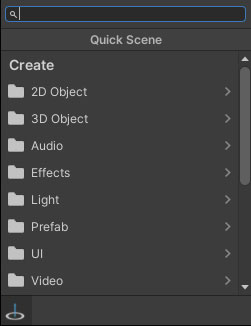
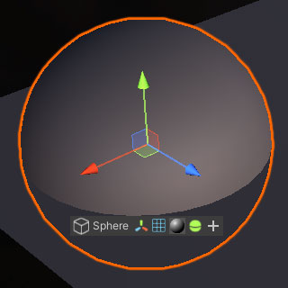

[](https://unity3d.com/get-unity/download)
[](https://github.com/nomnomab/Quick-Scene/blob/master/LICENSE.md)
[](https://github.com/keenanwoodall/Deform/compare)
[](https://openupm.com/packages/com.nomnom.quick-scene/)

An alternative to the Unity inspector for quicker modifications without leaving the scene.

## Features
- A quick menu for adding objects into the scene
- Object component modifications in-scene
- GameObject modifications in-scene
- Supports multi-object selection
- Add components to objects quickly

## Installation
### Install via UPM (using Git URL)
1. Navigate to your project's Packages folder and open the manifest.json file.
2. Add this line below the `"dependencies": {` line
```json
"com.nomnom.quick-scene": "https://github.com/nomnomab/Quick-Scene.git",
```
3. UPM should now install Quick Scene and it's dependencies.

Don't want to use git? Just download and unzip the repository into the Packages folder.

### Install via OpenUPM

The package is available on the [openupm registry](https://openupm.com). It's recommended to install it via [openupm-cli](https://github.com/openupm/openupm-cli).

```
openupm add com.nomnom.quick-scene
```

## Usage

### Scene placement
When holding Ctrl+Shift in a scene, you can bring up the placement gizmo. This placement gizmo will dictate where the
new object will be placed. Once a point has been determined, left-click to bring up the Add Window.
- Holding Ctrl+Shift+Alt will use origin placement instead.



Here you can select an object from the native GameObject creation window, or you can scroll down to select a prefab
from the project. Otherwise, you can use the search functionality to locate closest matching names.

At the bottom of the Add Window are additional placement options:
- Place along surface normal
- Parent to surface

### Scene toolbar
Once an object is selected, a toolbar will appear underneath it. This toolbar contains the following:
- Object name
- Object components
- Add component button



Clicking the object's name will show the GameObject toolbar. Clicking a component icon will show the given
component's inspector window underneath the toolbar.

At the end of the toolbar is an Add Component button. This will show the native Unity menu for the operation.

## FAQ
If my editor crashes, why is there a random floating window?
- This can happen due to the window not being closed properly. This can be fixed by resetting the Unity layout.

Why does my editor lose performance when in a component window or a GameObject window?
- This is a known issue with handling multiple in-scene editor windows. Other options are being looked at for more
performance.

Why is the search showing options that aren't relevant to what I typed in?
- Because I don't understand how Sublime's fuzzy search works so I did my best :(